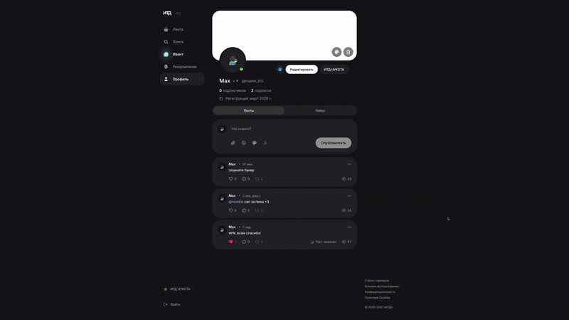

# баннер для итд.com
повторите как на гифке и будет все ок

[пруф баннера](https://итд.com/@maxim_812)

 [<p align="center"></p>](image/tutor.gif)

 ```JavaScript
    // в браузере вставь в коносль > открой холст > загрузи изображение > сохранить браузере
    // ВСЕ!
    (async()=>{const b=document.createElement('button');b.innerText='ВЫБРАТЬ ФАЙЛ';b.style='position:fixed;top:10px;left:10px;z-index:10000;padding:15px;background:#e91e63;color:white;border:none;border-radius:8px;cursor:pointer;font-weight:bold;box-shadow:0 4px 15px rgba(0,0,0,0.5);';document.body.appendChild(b);const i=document.createElement('input');i.type='file';i.accept='image/*';let d=null;i.onchange=e=>{const f=e.target.files[0];if(!f)return;const r=new FileReader();r.onload=ev=>{d=ev.target.result;HTMLCanvasElement.prototype.originalToDataURL=HTMLCanvasElement.prototype.toDataURL;HTMLCanvasElement.prototype.toDataURL=function(t,o){console.log("Система попыталась сделать скриншот холста. Подменяем на ваш файл...");return d};b.innerText='ГОТОВО! ТЕПЕРЬ ЖМИТЕ "ЗАГРУЗИТЬ БАННЕР"';b.style.background='#4CAF50';alert("Файл готов к подмене. Теперь просто нажмите кнопку сохранения в интерфейсе сайта. Неважно, что нарисовано на экране!")};r.readAsDataURL(f)};b.onclick=()=>i.click()})();
 ```

 мб буду обновлять, мб нет, хз